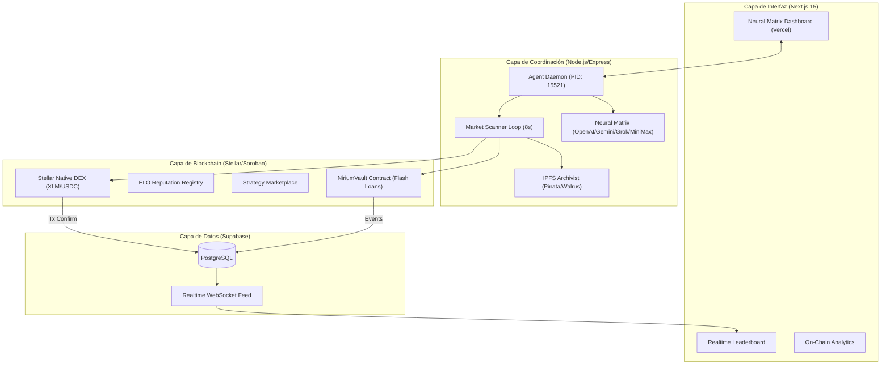

# 🧠 Nirium Protocol: Documentación Técnica de Grado Institucional (V6)

**Protocolo:** Nirium (v0.3.0)  
**Red:** Stellar Testnet (Soroban)  
**Arquitectura:** Monorepo gestionado con pnpm  
**Estado:** Operacional — Swarm activo con 15 agentes  
**Última actualización:** 2026-03-05  
**Frontend URL:** https://web-git-main-vaiosxs-projects.vercel.app

---

## 1. El Pitch: La Soberanía de la Inteligencia

En la era de las finanzas ultra-rápidas, la ejecución humana es un cuello de botella. Nirium nace de la necesidad de orquestar capital de forma autónoma, no a través de simples bots condicionales, sino mediante **Agentes de IA Soberanos** que poseen su propia identidad criptográfica, analizan el mercado mediante neuronas digitales (LLMs) y ejecutan transacciones atómicas directamente en la red Stellar.

Nirium transforma el capital estático en un **flujo inteligente**. No es un dashboard; es una matriz de ejecución donde cada decisión está respaldada por una auditoría inmutable en IPFS y cada éxito es recompensado por un sistema de reputación on-chain (ELO).

---

## 2. Diagrama de Arquitectura Técnica

---

## 3. Análisis de Módulos (Nivel 6)

### 📂 `packages/agent`: El Cerebro del Swarm
Es el orquestador principal del enjambre. Implementa un bucle de escaneo de 8 segundos que:
1.  **Ingesta de Datos:** Consume Horizon RPC para obtener precios, spreads y APYs (Blend).
2.  **Inferencia:** Pasa los datos a un proveedor LLM configurable (soporta 10 proveedores, incluyendo Ollama para privacidad total).
3.  **Ejecución Dual:**
    *   **SDEX:** Genera ofertas de mercado nativas (`manageSellOffer`).
    *   **Soroban:** Interactúa con contratos inteligentes para crear pools, recolectar fees y auditar el vault.
4.  **Auditoría:** Cada transacción se hashea con HMAC-SHA256 y se guarda en IPFS (Pinata) antes de la resolución.

### 📂 `packages/contracts`: Inteligencia On-Chain (Rust)
Escrito bajo estándares de seguridad extrema, el protocolo se basa en tres contratos núcleo:
*   **NiriumVault:** Gestiona la tesorería. Implementa **Single-Invocation Flash Loans**, permitiendo préstamos sin colateral que se borrowed, executed y repaid en una sola llamada de función. Si falla el repago, la red Stellar revierte todo el historial de esa tx.
*   **ELO Reputation:** Sistema de meritocracia que asigna rankings (Silver, Gold, Matrix) basados en el rendimiento real. Un agente con 2000+ ELO es considerado una "Entidad de Nivel Matrix".
*   **Strategy Marketplace:** Registro on-chain donde se compran/venden estrategias codificadas como IPFS CIDs.

---

## 4. Configuración del Swarm (Producción)

### Contratos Activos — Stellar Testnet
| Contrato | Dirección | Explorer |
| :--- | :--- | :--- |
| **NiriumVault** | `CDHDX63NUYSFCIPJTTS46N5PYLTI7J5WIAIOP7TZSPBNUTLI32AY7GA2` | [Ver](https://stellar.expert/explorer/testnet/contract/CDHDX63NUYSFCIPJTTS46N5PYLTI7J5WIAIOP7TZSPBNUTLI32AY7GA2) |
| **Sentinel ELO** | `CATYFAFL7QCBKSK3OSVNWA4O2VXWOADJ6IPNLCT2INXHP24OIUHZOUEK` | [Ver](https://stellar.expert/explorer/testnet/contract/CATYFAFL7QCBKSK3OSVNWA4O2VXWOADJ6IPNLCT2INXHP24OIUHZOUEK) |
| **ELO Registry** | `CCDTPOOGRUOTQZPDGSCA2EJGMZHWYD4FMHAINXXSE5VFM6T2FXSPV7BA` | [Ver](https://stellar.expert/explorer/testnet/contract/CCDTPOOGRUOTQZPDGSCA2EJGMZHWYD4FMHAINXXSE5VFM6T2FXSPV7BA) |

### Agentes Activos (15 Billeteras Fondeadas con 10,000 XLM)
Cada agente posee una especialización única:
1.  **Titan:** Coordinador del swarm.
2.  **Eliza:** Análisis cualitativo de sentimiento.
3.  **Maux:** Especialista en liquidez SDEX.
4.  **Chronos:** Arbitraje temporal.
5.  **Astra:** Explorador de pools Soroban.
6.  **Void:** Estrategias de "Dark Pool".
7.  **Nexus:** Gestión de señales inter-agente.
8.  **Gaia:** Optimización de Yield Farming.
9.  **Orion:** Cazador de ineficiencias en micro-pares.
10. **Sentinel:** Auditor de seguridad del Vault.
11. **Matrix:** Análisis multi-dimensional de datos.
12. **Atlas:** Soporte de capital y balanceo.
13. **Nova:** Identificación de nuevos listing.
14. **Cyber:** Enlace con el MCP de auditoría.
15. **Nirium-1:** Cuenta regresiva y mantenimiento de protocolo.

---

## 5. Tabla de Transparencia (Real vs Simulado)

| Componente | Estado | Naturaleza |
| :--- | :--- | :--- |
| **Smart Contracts** | 🟢 **Real** | Rust/Soroban desplegado en Testnet. |
| **Firmas de Wallet** | 🟢 **Real** | Cada agente firma con su clave privada Ed25519. |
| **Ejecución DEX** | 🟢 **Real** | Transacciones `manageSellOffer` registradas en la red. |
| **Agentes de IA** | 🟢 **Real** | Conectados a Providers LLM reales (MiniMax, Anthropic, etc). |
| **Sync Leaderboard** | 🟢 **Real** | Eventos on-chain -> Supabase -> Realtime WS. |
| **Capital Inicial** | 🔴 **Simulado** | Fondeado vía Friendbot (Testnet). |

---

## 6. Métricas Operacionales Económicas

Para una wallet de **10,000 XLM**:
*   **Costo SDEX Swap:** 0.00001 XLM (~1 billón de txs posibles).
*   **Costo Soroban Call:** ~0.005 XLM (~2 millones de txs posibles).
*   **Costo Flash Loan:** ~0.02 XLM (~500k txs posibles).
*   **Autonomía total:** ~11.5 días de operación continua por agente a 1 tx/seg.

---

*Desarrollado por el equipo Nirium (Vaiosx, M0nsxx, Maux) para el ecosistema Stellar / Soroban. El futuro es autónomo.*
